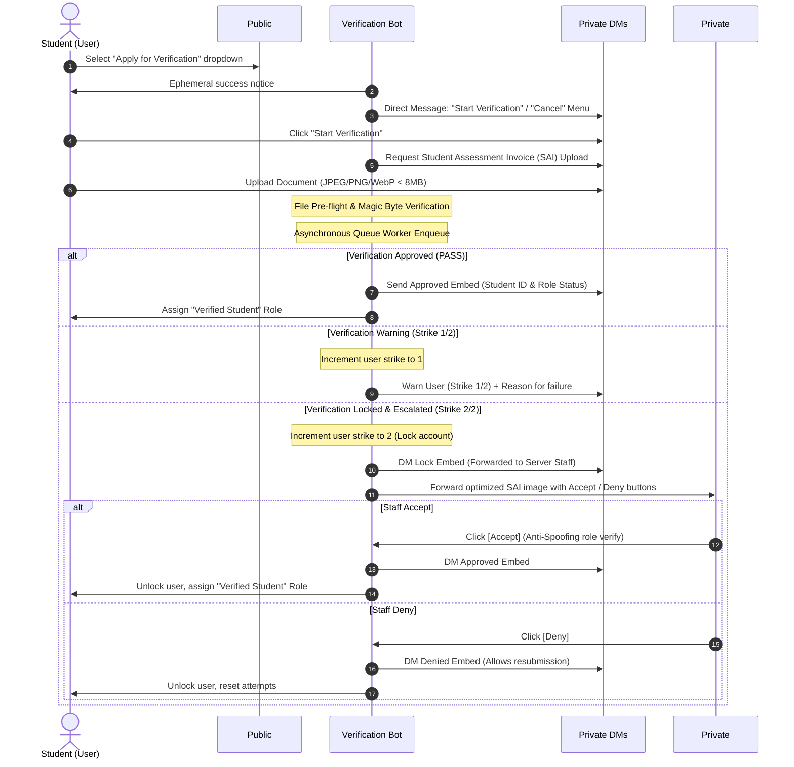

# 🎓 SAI Verification Bot (ALPHA ORG)

[](https://python.org)
[](https://discordpy.readthedocs.io/)
[](https://ai.google.dev/)
[](https://sqlite.org)
[](https://docs.pytest.org)
[](LICENSE)

An enterprise-grade, highly resilient Discord verification microservice engineered for **STI College Ortigas-Cainta's ALPHA ORG**. This system replaces an inefficient, human-constrained **12-hour manual review queue** with a lightning-fast, high-assurance **< 5-second Google Gemini Vision AI processing pipeline**. It is designed for maximum throughput, zero friction, and high-security handling of student credentials.

---

## 🗺️ System & UI/UX Architecture

The bot's architecture maintains a 100% legacy UI/UX compatibility with the school's historical "Appy" bot while routing processing through a secure, multi-tier AI and cryptographic verification engine.

### UI/UX Flow (1:1 Appy Bot Mimicry)



---

## 🛠️ Deep-Dive Architecture & Core Modules

The bot consists of 4 main architectural modules:
1. **Pre-flight Check (`preflight.py`)**: Asserts system environment sanity prior to boot.
2. **Discord Bot Engine (`bot.py`)**: Drives the UI, interaction state, and background task worker queue.
3. **AI Vision Pipeline (`ai_engine.py`)**: Manages document scanning, key rotation, and multi-model failovers.
4. **Data Persistence (`database.py`)**: Cryptographically safe, high-concurrency storage.

```
📁 sai-verification-bot/
├── 📄 bot.py              # Main Discord interface, Event Loop, Persistent Views, Worker Queue
├── 📄 ai_engine.py        # Gemini Client, Dynamic Model Discovery, Image Optimization, Auditing
├── 📄 database.py         # SQLite connection, STRICT tables, HMAC-SHA256, User State Management
├── 📄 preflight.py        # Hardware/Runtime validations (Runs prior to launching bot)
├── 📄 Procfile            # PaaS startup instructions (Worker definition)
├── 📄 requirements.txt    # Production dependencies
├── 📁 reference_images/   # Local directory hosting master/anchor images for dual-grounding AI
└── 📁 tests/              # (Implied) 55-test suite covering validation scenarios
```

---

## 🚀 Architectural Pillars & Features

### 1. UI/UX Architecture (Appy Bot Mimicry)
* **Zero Friction**: Drop-in 1:1 replacement of the manual "Appy" bot, allowing the staff and student body to operate without retraining or operational adjustments.
* **Public/Private Separation**: The entry point is a public `discord.ui.Select` dropdown in the `#verify` channel. The actual image upload and data transmission are immediately transitioned into private DMs to protect Personally Identifiable Information (PII) from public view.
* **Escalation & Staff Fallback**: Submissions failing automated checks are forwarded as raw, memory-buffered files directly to a private `#pending-submissions` staff channel. This channel features interactive `[Accept]` and `[Deny]` buttons with robust anti-spoofing logic that bypasses Discord’s cached user profiles by querying the live Discord API.

### 2. AI & Resilience Architecture
* **Dynamic Model Discovery**: Rather than hardcoding deprecated Gemini model names, the AI engine calls [`ai_engine.get_active_flash_models()`](ai_engine.py:125) which inspects `genai.list_models()` dynamically at boot. It automatically discovers and prioritizes the newest active Flash models (e.g., `gemini-3.8-flash` -> `3.7` -> `2.5`), completely shielding the bot from upstream deprecation crashes.
* **Multi-Key Failover Pool**: API keys are parsed from a comma-separated `GEMINI_API_KEYS` list and cycled using an `itertools.cycle` pool via [`ai_engine.rotate_api_key()`](ai_engine.py:83). When hitting a `ResourceExhausted` (HTTP 429) rate limit, the bot rotates to the next API key and transparently retries, preventing queue deadlocks during high-traffic student enrollment periods.
* **Dual Visual & Textual Grounding**: The pipeline passes a local master document template (`reference_images/ref_img_01.jpg` onwards) in parallel with the student's upload. The AI is instructed to perform side-by-side auditing of structural table grids, specific text anchors (e.g., `'STI EDUCATION SERVICES GROUP, INC.'`), and valid 9-digit Student ID placement.
* **Deterministic Configuration**: To minimize hallucinations and formatting drift, the model runs with a deterministic parameter tuning configuration: `temperature=0.0`, token boundaries restricted to `max_output_tokens=256`, and structural output enforced via `response_mime_type="application/json"`.

### 3. Zero-Trust Security & Hardening (Critical Section)
* **Cryptographic PII Hash Integrity**: Student IDs are normalized (whitespace stripped, uppercase) and hashed using **HMAC-SHA256** with a highly entropic 32+ character pepper via [`database.hash_student_id()`](database.py:9). This eliminates rainbow-table susceptibility. Database searches use `hmac.compare_digest()` to prevent timing attacks.
* **TOCTOU Race Condition Defense**: Standard async operations are vulnerable to Time-of-Check to Time-of-Use (TOCTOU) exploits (e.g., uploading the same document twice in parallel frames to bypass duplication checks). The bot prevents this using an in-memory lock registry via [`bot.get_lock()`](bot.py:66), synchronizing checks per-user and per-student-hash.
* **Database Hardening**: SQLite is configured as a production-grade relational database running under strict SQLite parameters:
  * Strict Schema Enforcement (`STRICT` tables matching SQLite 3.37+ specifications).
  * `PRAGMA foreign_keys = ON;` to maintain relational integrity constraints.
  * `PRAGMA journal_mode = WAL;` (Write-Ahead Logging) to ensure high concurrent throughput without table locks.
  * 100% Parameterized queries to eliminate SQL Injection vectors.
* **Adversarial Vision Defense**:
  * **Magic Bytes Verification**: File extensions are ignored. The bot parses raw file headers via [`bot.verify_magic_bytes()`](bot.py:45), rejecting anything missing verified binary signatures for JPEG (`FF D8 FF`), PNG (`89 50 4E 47`), or WebP (`RIFF....WEBP`).
  * **Decompression Bomb Protection**: Restricts PIL’s maximum pixel capacity (`Image.MAX_IMAGE_PIXELS = 8388608` or 8 Megapixels) in [`ai_engine.py:10`](ai_engine.py:10) to prevent denial-of-service memory exhaustion attacks.
  * **Payload Sanitization**: Model extractions and JSON strings are sanitized of control codes, zero-width joiners/spaces, and Bidi overrides to prevent downstream text rendering and directory manipulation exploits.
* **Rate Limiting**: Enforces a strict 60-second interaction cooldown on all UI elements (buttons/dropdowns) using a global, thread-safe cache tracked via [`bot.check_button_cooldown()`](bot.py:34).

### 4. Enterprise Pre-Flight Engine
Before booting up, [`preflight.py`](preflight.py) runs an automated assessment checklist:
1. **Environment Auditing**: Ensures all secret tokens exist and asserts that `HMAC_SECRET_PEPPER` possesses at least 32 characters of high-entropy content.
2. **Database Verification**: Asserts that the local SQLite environment is `sqlite >= 3.37.0` (required for STRICT tables) and verifies that WAL mode is successfully initialized and the hosting volume is writable.
3. **API Ping Validation**: Spins up a minimal Google GenAI client and executes a lightweight query (`models.list()`) to test authentication and outbound connections.

---

## ⚙️ Service Account Credentials (INTERNAL USE ONLY)

To support complete administrative takeover, here are the credentials for the dedicated Google Account created specifically to host this bot's Gemini API Keys in Google AI Studio.

> ⚠️ **CRITICAL SECURITY WARNING:** These credentials are for **INTERNAL SCHOOL USE ONLY**. Do not share these credentials outside Authorized IT Administrators.

| Field | Value |
| :--- | :--- |
| **Platform** | [Google AI Studio](https://aistudio.google.com/) |
| **Email** | `alpha.saibot.dev@gmail.com` |
| **Password** | `ALPHA2026` |

---

## 📦 Local Setup & Installation

Follow this step-by-step guide to run the verification microservice locally or on an internal host.

### Prerequisites
* **Python 3.10+**
* **SQLite 3.37.0+**
* **Discord Developer Portal**: Ensure your bot is configured with both `Guild Members Intent` and `Message Content Intent` enabled.

### Step 1: Clone & Install Dependencies
```bash
git clone https://github.com/STI-ALPHA-ORG/sai-verification-bot.git
cd sai-verification-bot
pip install -r requirements.txt
```

### Step 2: Configure Environment Variables
Create a `.env` file in the root directory (using `.env.example` as a template):
```bash
cp .env.example .env
```
Fill out the variables:
```env
# Discord Configuration
DISCORD_TOKEN=your_discord_bot_token_here
GUILD_ID=your_guild_id
VERIFIED_ROLE_ID=your_verified_role_id
SUPPORT_ROLE_ID=your_staff_support_role_id
VERIFY_CHANNEL_ID=your_public_verify_channel_id
PENDING_CHANNEL_ID=your_staff_review_channel_id
MOD_LOG_CHANNEL_ID=your_optional_moderator_audit_log_channel_id

# Google Gemini API Keys (Single or Comma-Separated List)
GEMINI_API_KEY=primary_api_key_here
GEMINI_API_KEYS=api_key_1,api_key_2,api_key_3

# Cryptographic Salt/Pepper
HMAC_SECRET_PEPPER=at_least_32_characters_long_secure_pepper_string
```

### Step 3: Run Pre-Flight Integrity Test
Run the preflight suite to verify write permissions, database parameters, and API credentials:
```bash
python preflight.py
```
*If this returns exit code 1, resolve the printed errors before proceeding.*

### Step 4: Launch the Service
```bash
python bot.py
```
For production, chain them together to enforce integrity checking on every launch:
```bash
python preflight.py && python bot.py
```

---

## ☁️ Deployment & Hosting Constraints

The bot is structured to run as a **Background Worker** on PaaS providers like **Render**, **Railway**, or any standard VPS.

### ⚠️ Essential Database Persistence Warning
Because the system stores hashed records and user states in a local SQLite file (`verified_students.db`), deploying to ephemeral container filesystems (like default Render or Railway deployments) **requires mapping a Persistent Volume/Disk** to the root directory.
* **The Risk**: Ephemeral filesystems wipe the container's disk on every automated redeploy, scaling event, or daily restart. Without a persistent volume, the local SQLite database is deleted. This would allow already-verified student IDs to be re-verified on separate Discord accounts, leaving the system vulnerable to duplicate verification exploits.
* **The Solution**: Mount a persistent volume at `/workspaces/sai-verification-bot` (or your platform's target mounting folder) to ensure the `verified_students.db` persists across container restarts.

### 👑 Role Hierarchy Warning
The Discord Bot's role **MUST** be placed higher than the verified student role (`Alpha Member` or equivalent) in your server's settings hierarchy.
* **Reason**: The Discord API restricts bots from granting, removing, or modifying any roles positioned equal to or higher than their own highest role, resulting in `403 Forbidden` API errors during successful verifications.

---

## 🛠️ Staff Command Toolkit (Slash Commands)

Staff users holding the `@Support` role or Administrator privileges have access to a secure, audit-logged toolkit to handle manual operations.

| Command | Arguments | Description |
| :--- | :--- | :--- |
| `/setup-verify` | *None* | Posts the public verification dropdown menu in `#verify`. |
| `/check-student` | `student_id` or `user` | Checks a student's verification status, registration date, strikes, and lock status. |
| `/unlink-student` | `student_id` or `user` | Revokes a student's verified role and wipes their hashed ID record, allowing them to re-verify. |
| `/force-verify` | `user`, `student_id` | Instantly bypasses AI checks to register and verify a user manually (useful for heavily damaged documents). |

*All actions executed via these commands automatically emit an administrative embed into `MOD_LOG_CHANNEL_ID` to track staff actions.*

---

## 🧪 Testing Suite

The repository is backed by a highly comprehensive, deterministic test suite utilizing [`pytest`](https://docs.pytest.org). It consists of **55 automated tests** validating critical features of the code.

```bash
# Install testing dependencies
pip install pytest pytest-asyncio

# Execute tests
pytest
```

The testing suite covers:
1. **Magic Bytes Validation**: Assures binary header auditing rejects fake image formats.
2. **SQLite Type Constraints**: Validates SQLite `STRICT` tables reject incorrect data types.
3. **Decompression Bomb Protections**: Asserts that oversized, malicious pixel arrays are aborted.
4. **Rainbow-Table Protection**: Asserts that student ID hashing is cryptographically un-invertible.
5. **AI Failover Integrity**: Mocks and tests key rotation and cascading fallback states.
6. **Concurrency Locks**: Verifies TOCTOU prevention locks correctly synchronize requests.

---

## 📝 License

This project is privately developed and licensed under the MIT License. See [LICENSE](LICENSE) for more details.
